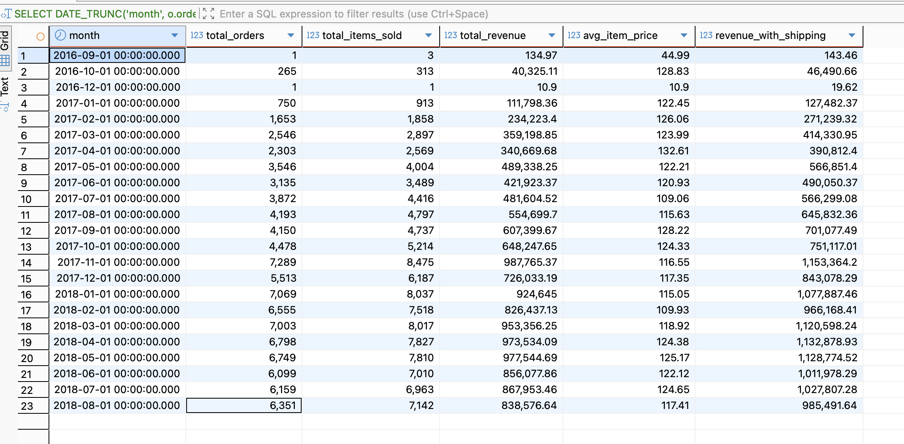

# Olist Brazilian E-Commerce SQL Analysis

## Project Overview
SQL analysis of 100,000+ orders from Brazilian e-commerce marketplace Olist (2016-2018). 

Demonstrates advanced SQL techniques including **Window Functions**, **CTEs**, **RFM Segmentation**, and **Cohort Analysis**.

---

## Business Questions

1. **Revenue trends**: Monthly patterns and seasonality effects (Black Friday spike)
2. **Customer segmentation**: RFM Analysis to identify Champions, At-Risk, and Lost customers
3. **Product performance**: Top revenue-generating categories
4. **Geographic insights**: State-level market concentration analysis
5. **Delivery performance**: On-time vs delayed delivery rates
6. **Customer satisfaction**: Category-level ratings and satisfaction rates
7. **Payment behavior**: Payment method preferences and installment patterns
8. **Customer retention**: Cohort analysis tracking repeat purchase behavior
9. **Revenue growth**: Month-over-month growth trends
10. **Customer lifetime value**: Segmentation by total spend (VIP, High, Medium, Low)

---

## Tech Stack

- **Database**: PostgreSQL 18
- **Tool**: DBeaver Community Edition
- **Dataset**: [Olist Brazilian E-Commerce](https://www.kaggle.com/datasets/olistbr/brazilian-ecommerce) (~100k orders)

---

## Project Structure
```
olist-sql-analysis/
├── README.md
├── sql/
│   └── olist_ecommerce_full_analysis.sql
└── results/
    ├── 01_overall_stats.png
    ├── 02_monthly_revenue.png
    ├── 03_top_categories.png
    ├── 04_geographic_analysis.png
    ├── 05_revenue_growth.png
    ├── 06_customer_segmentation.png
    ├── 07_delivery_performance.png
    ├── 08_satisfaction_by_category.png
    ├── 09_rfm_segments.png
    └── 10_cohort_retention.png
```

---

## Key SQL Skills Demonstrated

- **Complex JOINs** (5+ table joins for comprehensive analysis)
- **Window Functions** (ROW_NUMBER, RANK, LAG, NTILE, running totals)
- **CTEs** (Common Table Expressions for multi-step queries)
- **CASE statements** (conditional logic, customer segmentation)
- **Subqueries** (correlated and nested subqueries)
- **Aggregate Functions** (GROUP BY, HAVING, SUM, AVG, COUNT)
- **Date Functions** (DATE_TRUNC, EXTRACT, time-series analysis)
- **Views** (reusable queries for dashboards)
- **Data Quality Checks** (NULL analysis, reconciliation)

---

## Key Findings

### 1. Revenue Analysis
- **Peak month**: November 2017 (R$ 987,765) - Black Friday effect
- **Highest performing period**: Q4 2017 and Q1 2018
- **Monthly average**: ~R$ 550K in revenue
- **Total items sold**: 112,650+ products over 2 years



---

### 2. Top Product Categories
1. **Health & Beauty** - R$ 1,258,681 (8,836 orders)
2. **Watches & Gifts** - R$ 1,205,006 (5,624 orders)
3. **Bed Bath Table** - R$ 1,036,989 (9,417 orders)
4. **Sports & Leisure** - R$ 988,049 (7,720 orders)
5. **Computers & Accessories** - R$ 911,954 (6,689 orders)


---

### 3. Geographic Insights
- **SP (São Paulo)**: 40,501 orders (42% of total) - R$ 5.77M revenue
- **RJ (Rio de Janeiro)**: 12,350 orders (13%) - R$ 2.06M
- **MG (Minas Gerais)**: 11,354 orders (11%) - R$ 1.82M
- **Top 3 states = 66% of all revenue**

**Finding**: Strong market concentration in Southeast Brazil


---
### 4. Revenue Growth Trends
- **Massive early growth**: 29,777% MoM in Oct 2016
- **Stabilization**: 2-15% MoM growth throughout 2017-2018
- **Black Friday spike**: 52% growth in Nov 2017
- **Seasonal pattern**: Growth in Q4, decline in Q1


---
### 5. Customer Lifetime Value Segmentation
- **VIP**: 1,148 customers (avg LTV: R$ 1,585) - R$ 1.82M total
- **High Value**: 3,115 customers (avg LTV: R$ 679) - R$ 2.12M total
- **Medium Value**: 15,710 customers (avg LTV: R$ 292) - R$ 4.58M total
- **Low Value**: 73,423 customers (avg LTV: R$ 94) - R$ 6.90M total


---

### 6. Delivery Performance
- **On Time**: 88,644 orders (91.89%) - avg 10.9 days
- **Slightly Delayed**: 2,662 orders (2.76%) - avg 21.1 days
- **Delayed**: 1,819 orders (1.89%) - avg 26.7 days
- **Very Delayed**: 3,345 orders (3.47%) - avg 42.5 days

**Finding**: Strong on-time performance but room for improvement on delayed orders


---

### 7. Customer Satisfaction
- **Top rated categories**:
  - Books (General Interest): 4.48★ (89% satisfaction rate)
  - Books (Imported): 4.40★ (85%)
  - Books (Technical): 4.37★ (84%)
  - Luggage Accessories: 4.33★ (84%)

- **Overall satisfaction**: 80-89% across most categories
- **High engagement**: Books category shows highest ratings


---

### 8. Customer Segmentation (RFM Analysis)
- **Regular customers**: 27,733 (42% of revenue) - main segment
- **At Risk**: 22,848 customers (34% of revenue) - need re-engagement
- **Loyal Customers**: 11,560 (8% of revenue) 
- **Champions**: 912 customers (0.5% of revenue, avg lifetime value R$ 85)
- **Lost Customers**: 14,496 (7% of revenue)
- **New Customers**: 15,317 (7% of revenue)

**Key insight**: Most customers are one-time buyers - **huge opportunity for loyalty programs**


---

### 9. Cohort Retention Analysis
- **Month 1 retention**: 0.37-0.77% (very low)
- **Month 3 retention**: 0.18-0.60%
- **Best performing cohort**: July 2017 (0.77% retention at Month 1)

**Critical finding**: Extremely low repeat purchase rate - loyalty is a major issue


---

## Business Recommendations

### Immediate Actions:
1. **Launch aggressive loyalty program** - current 0.5-0.7% retention is unsustainable
   - Offer points/rewards for repeat purchases
   - Email campaigns for 2nd order discounts
   
2. **Re-engage 22,848 "At Risk" customers** (34% of revenue at stake)
   - Targeted win-back campaigns
   - Personalized product recommendations
   
3. **Optimize delivery for "Very Delayed" segment** (3.5% of orders)
   - Investigate root causes (avg 42.5 days is excessive)
   
4. **Double down on SP market** - 42% of orders, strong AOV (R$ 124)
   - Premium product launches
   - Local warehouse/fulfillment

### Strategic Initiatives:
1. **Expand Books & Health/Beauty categories** - highest satisfaction + revenue
2. **Q4 inventory planning** - Black Friday effect is massive (52% MoM growth)
3. **Focus on RJ and MG markets** - growing regions, higher AOV than SP

---

## Contact

**Yuliia Lekh** | [LinkedIn](https://www.linkedin.com/in/yuliia-lekh-ab73ab238/) | julia.030872@gmail.com

*Open to Junior Data Analyst and BI Engineer roles*

---

## Additional Resources

- **Dataset Source**: [Kaggle - Olist Brazilian E-Commerce](https://www.kaggle.com/datasets/olistbr/brazilian-ecommerce)
- **SQL Scripts**: See `sql/` folder for full analysis code
- **Visualizations**: See `results/` folder for all query outputs
